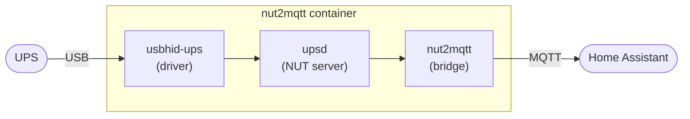

# NUT to MQTT Bridge

[](LICENSE)
[](https://www.python.org/)
[](https://networkupstools.org/)

A lightweight Python bridge that polls UPS data from
[Network UPS Tools (NUT)](https://networkupstools.org/) using `upsc` and publishes
metrics to MQTT for integration with [Home Assistant](https://www.home-assistant.io/).

This project is intentionally lightweight and avoids custom HA integrations by
leveraging MQTT Discovery.

---

## Features

- Polls UPS metrics via `upsc`
- Publishes UPS status and sensor values to MQTT
- Auto-discovers entities in Home Assistant via MQTT Discovery
- Publishes a **UPS Connected** binary sensor using MQTT LWT for reliable offline detection
- Optionally exposes NUT instant commands (e.g. muting the beeper) as Home Assistant buttons via `upscmd`
- Optionally exposes a NUT status variable plus a pair of on/off commands as a Home Assistant switch (e.g. an optimistic beeper toggle)
- Supports Home Assistant entity categories (e.g. diagnostics)
- Configurable via YAML
- Runs as a systemd service or a container (Dockerfile included)

---

## Why LWT Instead of a Heartbeat

MQTT sensors in Home Assistant only update their `last_updated` timestamp when
the **state value changes**. For UPS data, some values (like `OL`) may remain
unchanged for hours or days, making it hard to know if the bridge is still running.

This project uses MQTT **Last Will and Testament (LWT)** to solve this cleanly.

- When the bridge starts, it publishes `online` to the availability topic
- When the bridge stops gracefully or crashes, the broker automatically publishes `offline`
- Home Assistant marks all sensors as `unavailable` when the availability topic goes `offline`
- A **UPS Connected** binary sensor reflects live reachability of the UPS itself

This makes the system resilient to:

- Raspberry Pi shutdowns
- Network failures
- Silent process crashes

---

## Requirements

- [Network UPS Tools (NUT)](https://networkupstools.org/) installed and configured
- `upsc` accessible on the system path
- MQTT broker (e.g. [Mosquitto](https://mosquitto.org/))
- Home Assistant with MQTT integration enabled
- Python 3.8+

---

## Installation

### 1. Clone the repo

```bash
git clone https://github.com/zackwag/nut2mqtt.git
cd nut2mqtt
```

### 2. Install dependencies

```bash
sudo pip3 install -r requirements.txt --break-system-packages
```

### 3. Configure

Copy or edit `config.yaml` and replace each occurrence of `[CHANGEME]` with the correct information.

```bash
cp config.yaml.example config.yaml
```

The configuration controls:

- MQTT connection details
- UPS name used by `upsc`
- Which UPS metrics are published
- Optional Home Assistant metadata (icons, units, entity category)

### 4. Test run

```bash
python3 nut2mqtt.py
```

---

## Configuration Reference

### `mqtt`

| Key | Required | Default | Description |
| --- | --- | --- | --- |
| `broker` | ✅ | — | MQTT broker IP address |
| `port` | ❌ | `1883` | MQTT broker port |
| `username` | ✅ | — | MQTT broker username |
| `password` | ✅ | — | MQTT broker password |
| `base_topic` | ❌ | `nut2mqtt` | Base MQTT topic prefix |
| `client_id` | ❌ | `nut2mqtt` | MQTT client identifier |

### `ups`

| Key | Required | Default | Description |
| --- | --- | --- | --- |
| `name` | ✅ | — | UPS name as configured in NUT (used with `upsc`) |
| `friendly_name` | ✅ | — | Display name used in Home Assistant |
| `poll_interval` | ❌ | `30` | Seconds between polls |
| `startup_max_attempts` | ❌ | `5` | Retry attempts if UPS unreachable at startup |
| `startup_retry_delay` | ❌ | `2` | Seconds between startup retries |
| `upscmd_username` | ⚠️ | — | Required only if `commands` is used — NUT username with `INSTCMD` rights |
| `upscmd_password` | ⚠️ | — | Required only if `commands` is used — password for `upscmd_username` |

### `sensors`

Each sensor entry supports the following fields:

| Key | Required | Description |
| --- | --- | --- |
| `key` | ✅ | NUT variable name (e.g. `battery.charge`) |
| `friendly_name` | ✅ | Display name in Home Assistant |
| `unit` | ❌ | Unit of measurement (e.g. `%`, `V`, `s`) |
| `icon` | ❌ | MDI icon (e.g. `mdi:battery`) |
| `device_class` | ❌ | Home Assistant device class (e.g. `battery`, `voltage`) |
| `entity_category` | ❌ | Set to `diagnostic` to move sensor to Diagnostics section |

### `commands`

Optional. Each entry publishes a Home Assistant **button** entity that runs a
[NUT instant command](https://networkupstools.org/docs/user-manual.chunked/apcs01.html)
(via `upscmd`) when pressed — for example, muting the UPS beeper.

| Key | Required | Description |
| --- | --- | --- |
| `key` | ✅ | NUT instant command name (e.g. `beeper.mute`) |
| `friendly_name` | ✅ | Display name in Home Assistant |
| `icon` | ❌ | MDI icon (e.g. `mdi:volume-mute`) |
| `entity_category` | ❌ | `config` (Configuration section), `diagnostic` (Diagnostic section), or omit for the main Controls section |

Use `config` for buttons that change a persistent device behavior (e.g. `beeper.mute`/`beeper.enable`)
and `diagnostic` for buttons that trigger a self-test or maintenance action (e.g. `test.battery.*`).

Using `commands` requires `ups.upscmd_username` / `ups.upscmd_password` to be
set to a NUT user with `INSTCMD` privileges for those commands, configured in
`upsd.users` on the NUT server, e.g.:

```plaintext
[nut2mqtt]
    password = [CHANGEME]
    instcmds = beeper.mute
    instcmds = beeper.enable
    instcmds = beeper.disable
    instcmds = test.battery.start.quick
    instcmds = test.battery.stop
```

Run `upscmd -l <ups_name>` on the NUT server to list the instant commands your
UPS and driver support — not all UPS models support beeper control or the same
command names.

### `switches`

Optional. Each entry publishes a Home Assistant **switch** entity. It reads a NUT
status variable for its state and runs one of two [instant commands](https://networkupstools.org/docs/user-manual.chunked/apcs01.html)
(via `upscmd`) when toggled — for example, an on/off beeper toggle backed by
`ups.beeper.status` + `beeper.enable` / `beeper.disable`.

| Key | Required | Description |
| --- | --- | --- |
| `key` | ✅ | Short identifier for the entity (e.g. `beeper`) |
| `friendly_name` | ✅ | Display name in Home Assistant |
| `status_key` | ✅ | NUT variable read back for the switch state (e.g. `ups.beeper.status`) |
| `command_on` | ✅ | NUT instant command run when switched **on** (e.g. `beeper.enable`) |
| `command_off` | ✅ | NUT instant command run when switched **off** (e.g. `beeper.disable`) |
| `state_on` | ❌ | `status_key` value(s) that mean **on** — string or list. Default: `enabled` |
| `optimistic` | ❌ | `false` (default): a normal sliding toggle driven by `status_key`. `true`: Home Assistant renders it as a pair of on/off push buttons and assumes the command worked — use it only if your UPS does not report `status_key` |
| `icon` | ❌ | MDI icon (e.g. `mdi:bell`) |
| `entity_category` | ❌ | `config`, `diagnostic`, or omit for the main Controls section |

After a toggle, the bridge runs the command, waits briefly, then re-reads
`status_key` and republishes the real state — so even in `optimistic: false`
mode the switch converges within a couple of seconds instead of a full poll.

Like `commands`, this needs `ups.upscmd_username` / `ups.upscmd_password` set to
a NUT user with `INSTCMD` rights for `command_on` and `command_off` in
`upsd.users`. If you use the switch, drop any button/sensor you had for the same
thing (e.g. a `beeper.enable` button or a `ups.beeper.status` sensor) to avoid
duplicate entities.

---

## Run in Docker

The included image bundles everything in **one container**: the UPS driver, the
NUT server (`upsd`), and the nut2mqtt bridge, wired together by
[`docker/entrypoint.sh`](docker/entrypoint.sh). It expects the UPS on **USB**.



### 1. NUT server config

```bash
for f in nut/*.example; do cp "$f" "${f%.example}"; done
```

Edit `nut/ups.conf` and set the `driver` for your model — `usbhid-ups` for most
USB units, `nutdrv_qx` for many cheaper ones. The section name (`[ups]`) is the
UPS name used everywhere else. Set a real password in `nut/upsd.users` only if
you plan to use `commands:` (instant commands like `beeper.mute`).

### 2. Bridge config

```bash
cp config.yaml.example config.yaml
```

Fill in the `mqtt` block. Set `ups.name: "ups"` to match the section in
`nut/ups.conf`, and set `ups.friendly_name`. For instant commands, set
`ups.upscmd_username` / `ups.upscmd_password` to match `nut/upsd.users`.

### 3. Build and run

```bash
docker build -t nut2mqtt .

docker run -d --name nut2mqtt --restart unless-stopped \
  --device /dev/bus/usb:/dev/bus/usb \
  -v "$PWD/nut:/etc/nut:ro" \
  -v "$PWD/config.yaml:/data/config.yaml:ro" \
  -v nut2mqtt-data:/data \
  nut2mqtt
```

Check the logs and confirm the UPS is visible:

```bash
docker logs -f nut2mqtt
docker exec nut2mqtt upsc ups
```

`nut/` is mounted read-only at `/etc/nut`; `config.yaml` read-only at
`/data/config.yaml`. The `nut2mqtt-data` named volume holds `last_values.json`
(so Home Assistant sensor state survives a restart) and `device_info.json` (the
last known-good UPS manufacturer/model/firmware, so a restart doesn't briefly
publish "unknown" before the driver has polled them back).

To expose the NUT server to your LAN (e.g. for Home Assistant's own NUT
integration), set `LISTEN 0.0.0.0 3493` in `nut/upsd.conf` and add `-p 3493:3493`
to the `docker run` command.

> **Bridge only:** to run against a NUT server you already have, add
> `-e RUN_NUT_SERVER=0`, drop the `--device` and `-v "$PWD/nut:/etc/nut:ro"`
> flags, and point `ups.name` at `upsname@host` in `config.yaml`.

### Running inside a Proxmox LXC

The UPS has to be passed through twice: **host → LXC**, then **LXC → container**.

**Host → LXC.** Run `lsusb` on the Proxmox host to find the UPS, then add to
`/etc/pve/lxc/<vmid>.conf`:

```plaintext
# Docker-in-LXC
features: nesting=1,keyctl=1
# USB passthrough (189 = USB character-device major)
lxc.cgroup2.devices.allow: c 189:* rwm
lxc.mount.entry: /dev/bus/usb dev/bus/usb none bind,optional,create=dir
```

A **privileged** LXC is the least fiddly for USB; an unprivileged one also works
with the two `lxc.*` lines above. Restart the LXC after editing.

**LXC → container.** Handled by `--device /dev/bus/usb:/dev/bus/usb` on the
`docker run` command shown above.

If the UPS is unplugged and replugged, restart the container so it picks up the
new device node.

---

## Run as a System Service (Recommended)

### 1. Create a dedicated system user

```bash
sudo useradd --system --no-create-home --group nogroup ups
```

### 2. Copy files to install directory

```bash
sudo mkdir -p /opt/nut2mqtt
sudo cp -r . /opt/nut2mqtt
sudo chown -R ups:nogroup /opt/nut2mqtt
```

### 3. Install dependencies

```bash
sudo pip3 install -r /opt/nut2mqtt/requirements.txt --break-system-packages
```

### 4. Copy the service file

```bash
sudo cp systemd/nut2mqtt.service /etc/systemd/system/
```

### 5. Reload systemd and enable service

```bash
sudo systemctl daemon-reload
sudo systemctl enable --now nut2mqtt
```

### 6. Check status

```bash
systemctl status nut2mqtt
```

### 7. View logs

```bash
journalctl -u nut2mqtt -f
```

---

## Home Assistant

With MQTT Discovery enabled, entities appear automatically under a **UPS** device
in Settings → Devices & Services → MQTT.

### Example Entity Names

Assuming `friendly_name` is set to `Den UPS`:

| Entity ID | Name |
| --- | --- |
| `sensor.den_ups_battery_charge` | Den UPS Battery Charge |
| `sensor.den_ups_input_voltage` | Den UPS Input Voltage |
| `sensor.den_ups_output_voltage` | Den UPS Output Voltage |
| `sensor.den_ups_status_data` | Den UPS Status Data |
| `binary_sensor.den_ups_connected` | Den UPS Connected |

### Diagnostics vs Sensors

Sensors marked with `entity_category: diagnostic` appear under **Device → Diagnostics**
instead of cluttering dashboards. Recommended diagnostic entities include firmware info,
runtime thresholds, and delay timers.

### Example Sensors

- Battery Charge (%)
- Battery Runtime (s)
- Input / Output Voltage (V)
- UPS Load (%)
- UPS Status
- UPS Connected (binary)

> **Note:** Derived or user-facing logic (for example: "UPS Online") is intentionally
> left to Home Assistant templates.

---

## Contributing

Pull requests are welcome! If you have improvements — new sensors, config options, bug fixes —
open an issue or PR.

## License

MIT
